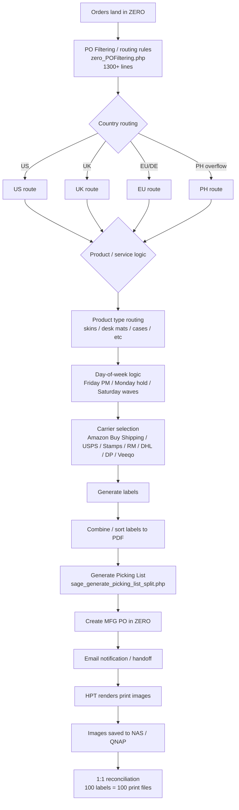
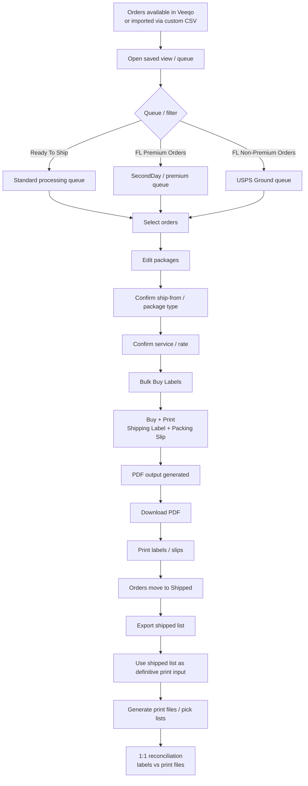
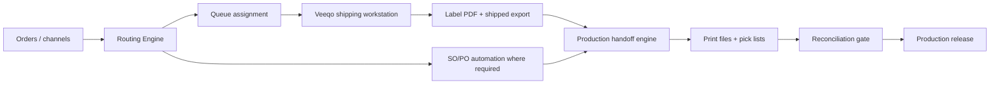

# Order Management / Fulfillment Migration Spec

*Prepared by Harry — 2026-03-09*

## Purpose
Map Patrick's current end-to-end fulfillment pipeline against the emerging Veeqo-based flow so the business can:
- see the real current operating chain
- identify what Veeqo already replaces
- identify what still remains in ZERO / PHP / manual handling
- use this as the migration spec for the Order Management / Fulfillment workstream

---

## Executive Summary

The fulfillment process is not one workflow today. It is a stitched-together operating chain made of:

1. **ZERO/PHP routing and preparation**
2. **Carrier-specific or Veeqo label generation**
3. **SO/PO internal movement workflow**
4. **Print-file generation and 1:1 reconciliation**

The most important discovery from Patrick's materials is that **Veeqo currently replaces only part of the chain**.
It helps with order queueing, package/service setup, bulk label buying, and PDF output.
It does **not** by itself replace the upstream routing intelligence, SO/PO creation logic, or downstream print-image generation.

So the migration should be framed as:
- **ZERO/PHP = routing + orchestration legacy core**
- **Veeqo = shipping workstation / label execution layer**
- **HPT / print layer = downstream production layer**

---

## Current-State "Before" Flow (Patrick / ZERO-led)

### Notes on the legacy stack
- Routing logic appears to live primarily in custom PHP scripts and supporting SQL queries.
- Timing waves matter operationally, e.g. UK/FL prime and non-prime waves by time of day.
- Country and service logic are entangled with product capability, day-of-week cutoffs, and internal warehouse movement.
- This is why the process feels brittle: multiple decisions are made before label purchase even begins.

---

## Current-State "After" Flow (Veeqo-led execution layer)

### What Patrick's Veeqo docs confirm
- There are explicit Veeqo views such as **Ready To Ship (FL Premium Orders)** and **Ready To Ship (FL Non-Premium Orders)**.
- FL Premium setup uses:
  - Dispatch Date = This Week
  - Delivery Method = SecondDay
  - FedEx 2Day One Rate
- Manual-import queues exist for channels / orders not flowing directly into Veeqo.
- Custom CSV generators exist for Veeqo import, including:
  - `veeqo_import_customlabel.php`
  - `veeqo_picking_list.php`
- Operators bulk-edit packages and services before bulk label purchase.
- The output is a combined PDF containing labels and packing slips.
- Orders are expected to be **sorted by SKU** before bulk buying labels.

---

## Side-by-Side Step Mapping

| Legacy ZERO / Patrick step | Veeqo replacement state | Status | Notes |
|---|---|---:|---|
| Orders land in ZERO | Orders appear in Veeqo or are imported via CSV | Partial | Some channels still require manual import / CSV bridge |
| `zero_POFiltering.php` routing rules | Saved views + package/service edits in Veeqo | Partial | Veeqo handles execution views, not full routing intelligence |
| Country routing | Separate Veeqo views / import batches | Partial | Needs explicit queue taxonomy |
| Product type routing | Mostly still outside Veeqo | Not replaced | Critical because product capability affects site / print path |
| Day-of-week logic (Friday PM / Monday hold) | Not visibly native in current Veeqo SOP | Not replaced | Must stay in upstream logic layer |
| Carrier selection across systems | Package/service selection inside Veeqo | Partial | Good for FL queues; broader multi-region logic still external |
| Generate labels in carrier portals | Bulk Buy + Print in Veeqo | Replaced for covered flows | Strongest current Veeqo win |
| Combine labels to PDF | Native PDF output in Veeqo | Replaced | Confirmed by Patrick's doc |
| Picking list generation (`sage_generate_picking_list_split.php`) | Not clearly replaced | Not replaced | Still needs explicit successor path |
| Create MFG PO in ZERO | Still in ZERO | Not replaced | Internal warehouse/accounting layer |
| Email SO/PO notification | Still manual / ZERO-led | Not replaced | Internal communications workflow remains |
| HPT renders print images | Still downstream non-Veeqo | Not replaced | Production system, not shipping system |
| Save images to NAS (QNAP) | Still downstream non-Veeqo | Not replaced | Print infrastructure |
| 1:1 reconciliation labels vs print files | Still required | Not replaced | Must become a formal control gate |

---

## Core Reality: What Veeqo Actually Replaces

### Replaced or substantially improved
- queue-based ready-to-ship processing
- carrier/service execution for supported flows
- package editing at batch level
- bulk label buying
- combined PDF generation for labels + packing slips
- operator workflow for FL premium / non-premium processing

### Not replaced
- upstream routing brain
- country + product + equipment + cut-off logic
- internal SO/PO generation and warehouse movement logic
- print-file generation
- image rendering to production storage
- final reconciliation control between shipping and production

---

## Actual Operating Layers

### Layer 1 — Routing / orchestration brain
Still largely legacy.
Includes:
- country routing
- product capability routing
- stock-based routing
- day/time cutoffs
- special Amazon logic
- overflow / holiday / PH rules

### Layer 2 — Label execution workstation
Veeqo's strongest role.
Includes:
- working views
- package edits
- service/rate edits
- bulk buy + print
- shipped queue progression

### Layer 3 — Production handoff
Still outside Veeqo.
Includes:
- shipped export
- print list creation
- HPT rendering
- NAS/QNAP save path
- 1:1 reconciliation

---

## Operational Risks / Gaps

### 1. Veeqo is being asked to stand in for a bigger orchestration system than it actually is
That creates ambiguity about what is owned by:
- Veeqo
- ZERO/PHP
- PH operator knowledge
- print production tools

### 2. Queue definitions are operationally critical but not yet fully codified
We need a formal queue matrix for:
- FL premium
- FL non-premium
- UK prime
- UK non-prime
- EU/DE
- manual import channels
- exceptions / holds / overflow / Amazon overrides

### 3. Product-type routing is still under-documented in fulfillment docs
This matters because shipping and production cannot be separated cleanly if a SKU can only be made at certain sites.

### 4. The 1:1 reconciliation rule is important but still procedural, not system-enforced
This should become a hard control point.

### 5. Internal transfer logic (SO/PO) is still manual and email-driven
This is probably the messiest surviving part of the chain.

---

## Recommended Future-State Architecture

### Interpretation
- **Routing Engine** should own the business logic.
- **Veeqo** should remain the shipping workstation.
- **Production handoff engine** should transform shipped export into print-ready control outputs.
- **Reconciliation gate** should block mismatches.

---

## First Build Targets for Harry

### 1. Queue taxonomy spec
Create the definitive list of queue/view names and their rule logic.

### 2. Current-state flow diagram
Use this document's Mermaid flow as the baseline visual artifact.

### 3. Label-to-print handoff spec
Define:
- exact shipped export source
- required fields
- naming conventions
- GDrive / NAS destination rules
- 1:1 reconciliation logic

### 4. SO/PO decision tree
Document when internal transfer logic is required versus when Veeqo-only shipping is sufficient.

### 5. Exception matrix
Formalize handling for:
- Amazon override
- missing stock
- Friday / Saturday / holiday holds
- printer downtime
- site capability mismatch
- import failures

---

## Suggested Immediate Next Discussion

Use this as the discussion frame with Cem:
1. Confirm whether **all routing decisions still originate in ZERO/PHP**, or whether some now originate directly in Veeqo views.
2. Confirm whether **picking list generation** is still `sage_generate_picking_list_split.php` or has partly moved.
3. Confirm the exact point where **HPT** takes over after shipped export.
4. Confirm which queues are truly live today vs draft / test.
5. Confirm where the final authoritative 1:1 reconciliation is currently done.

---

## Evidence used
- `Brain/Projects/shipping/SOP_SHIPPING_LABEL_PROCESS.md`
- `Brain/Projects/shipping/SHIPPING_CARRIER_RULES.md`
- `Brain/Projects/shipping/Order Management_Shipping labels Process/Generating Labels/Veeqo Order Processing/Veeqo US guide for printing FL Premium labels.docx`
- `Brain/Projects/shipping/Order Management_Shipping labels Process/Generating Labels/Veeqo Order Processing/Import Manual Orders in Veeqo.docx`
- `Brain/Projects/shipping/Order Management_Shipping labels Process/Dev Task/Automated PO timings/Automated PO Timings.txt`
- `Brain/PH Staff/IT／Dev Team/Manual Guide for SO-PO shipment.docx`
- `Brain/PH Staff/IT／Dev Team/Veeqo Screenshots/*`
- memory references on Feb 10 / Feb 21 regarding Veco/Veeqo and fulfillment rules
